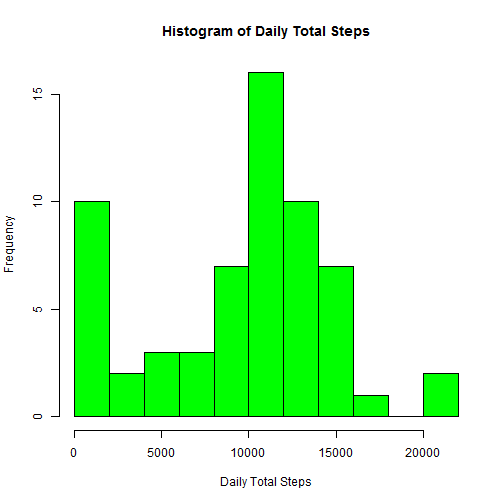

# Reproducible Research: Peer Assessment 1
========================================================

This file consists data from a personal activity monitoring device with data samplings at 5 minute intervals through out the day. The data consists of two months of data from an anonymous individual collected during the months of October and November, 2012 and include the number of steps taken in 5 minute intervals each day over 24 hours.

The variables included in this dataset are:
* *steps*: Number of steps taking in a 5-minute interval (missing values are coded as NA)
* *date*: The date on which the measurement was taken in YYYY-MM-DD format
* *interval*: Identifier for the 5-minute interval in which measurement was taken

The assignment consists of code which:  
  1. loads the data from a .csv file  
  2. Determines the mean total number of steps taken per day and displays a histogram  
  3. Plots a line that displays the average daily activity pattern and calculates the   maximum activity time interval  
  4. Creates a new dataset Where Steps data are missing by imputing missing values with the mean value for that time interval across all days.  With the imputed data set redo the the previous graphs and calculations to see how the results may have changed  
  5. Compare activity patterns between weekdays and weekends utlizing a line plot with time-intervals on the x-axis and mean steps on the y-axis  

## Loading and preprocessing the data


```r
# Set working directory and read in data
setwd("C:/Research/Coursera/DataScientist_Series/Class_04_ReproducibleResearch/PeerAssessment_1/")

mainData_Activity <- read.csv("repdata_data_activity_uncompressed/activity.csv")
```

## What is the mean total number of steps taken per day?


```r
# Function to calculate total number of steps taken per day

f_totalSteps <- function(dframe) { 
        totSteps <- integer(61)
	date <- character(61)

	i <- 1
	for(dte in levels(dframe$date)) {
		sumsteps <- sum(dframe$steps[dframe$date == dte], na.rm = TRUE)	
		totSteps[i] <- sumsteps
		date[i] <- dte
		i <- i + 1
	}
	cbind(as.data.frame(date), as.data.frame(totSteps))
}


Daily_Total_Steps <- f_totalSteps(mainData_Activity)


# Create histogram with frequency of daily total steps

hist(	Daily_Total_Steps$totSteps, 
	main = "Histogram of Daily Total Steps",
	xlab = "Daily Total Steps",
	breaks = 8, 
	col = "green")
```

 

```r
# From the data frame created with Daily total steps data, calculate and print to the screen
# The mean and median total daily steps

mean_output <- mean(Daily_Total_Steps$totSteps, na.rm = TRUE)
median_output <- median(Daily_Total_Steps$totSteps, na.rm = TRUE)

cat("Mean Total Steps per day: ",  mean_output, "\n")
```

```
## Mean Total Steps per day:  9354
```

```r
cat("Median Total Steps per day: ", median_output, "\n")
```

```
## Median Total Steps per day:  10395
```
As can be seen in the histogram, the distribution is bi-modal with two peaks at close to 0 and a little above 10,000.  These two peaks are probably during sleeping time periods and during the day.  Also, the mean total number of steps (9354.23) is lower than the median total daily steps (10395) indicating a slightly left-skewed distribution.


## What is the average daily activity pattern?


```r
# function to calculate the mean number of steps for each 5-minute time interval
# across all the days covered by the data. Each day has 12 * 24 intervals - 288

f_interval <- function(dframe) {

        meanSteps <- integer(288)
	interval <- integer(288)

	i <- 1
	for(intval in levels(as.factor(dframe$interval))) {

		meansteps <- mean(dframe$steps[as.factor(dframe$interval) == intval], na.rm = TRUE)
		meanSteps[i] <- meansteps
		interval[i] <- as.numeric(intval)
		i <- i + 1
	}
	cbind(as.data.frame(interval), as.data.frame(meanSteps))
}


Interval_Mean_Steps <- f_interval(mainData_Activity)

# Plot the mean steps-per-interval data  

plot(	Interval_Mean_Steps$interval, 
	Interval_Mean_Steps$meanSteps, 
	main = "Mean Steps-per-interval",
	xlab = "5-minute time intervals",
	ylab = "Mean Steps",
	type = "l", 
	col = "darkblue")
```

 

```r
# calculate and print out the Time-interval with the max mean steps
max_steps <- max(Interval_Mean_Steps$meanSteps)
max_interval <- Interval_Mean_Steps$interval[Interval_Mean_Steps$meanSteps == max(Interval_Mean_Steps$meanSteps)]

cat("Time-interval with maximum mean steps, interval ", max_interval, "\n")
```

```
## Time-interval with maximum mean steps, interval  835
```

```r
cat("With that interval having a mean of: ", max_steps, "steps\n") 
```

```
## With that interval having a mean of:  206.2 steps
```

The results of the plot indicate the maximum average number of steps is at interval 835 with an average number of steps equal to 206.  


## Imputing missing values

Some of the steps variable data are missing.  As a result a new data set is constructed from the original data with all the missing values filled in with the average number of steps for a given time interval.  Graphs and caculations are then repeated using the imputed data set.


```r
# Construct a new data set with missing values imputed from the mean number of steps
# for a particular interval

imputeData_Activity <- mainData_Activity

for (i in 1:nrow(imputeData_Activity)) {
        if (is.na(imputeData_Activity[i,]$steps)) {
		index <- imputeData_Activity[i,]$interval
		numSteps <- Interval_Mean_Steps$meanSteps[Interval_Mean_Steps$interval == index]
		imputeData_Activity[i,]$steps <- numSteps
	}
}


## re-do histogram and re-calculate the mean and median values with imputed data

Daily_Total_Steps <- f_totalSteps(imputeData_Activity)


# Re-create histogram from imputed data with frequency of daily total steps

hist(	Daily_Total_Steps$totSteps, 
	main = "Histogram of Daily Total Steps (Imputed data)",
	xlab = "Daily Total Steps",
	breaks = 8, 
	col = "blue")
```

 

```r
# From the data frame created with Daily total steps data, calculate and print to the screen
# The mean and median total daily steps

mean_output <- mean(Daily_Total_Steps$totSteps, na.rm = TRUE)
median_output <- median(Daily_Total_Steps$totSteps, na.rm = TRUE)

cat("(imputed data) Mean Total Steps per day: ",  mean_output, "\n")
```

```
## (imputed data) Mean Total Steps per day:  10766
```

```r
cat("(imputed data) Median Total Steps per day: ", median_output, "\n")
```

```
## (imputed data) Median Total Steps per day:  10766
```

```r
## re-do plot and re-calculate the Time-interval with the max mean step with imputed data

Interval_Mean_Steps <- f_interval(imputeData_Activity)

plot(	Interval_Mean_Steps$interval, 
	Interval_Mean_Steps$meanSteps, 
	main = "Mean Steps-per-interval  (Imputed data)",
	xlab = "5-minute time intervals",
	ylab = "Mean Steps",
	type = "l", 
	col = "darkblue")
```

 

```r
# re-calculate and print out the Time-interval with the max mean steps

max_steps <- max(Interval_Mean_Steps$meanSteps)
max_interval <- Interval_Mean_Steps$interval[Interval_Mean_Steps$meanSteps == max(Interval_Mean_Steps$meanSteps)]

cat("(imputed data) Time-interval with maximum mean steps, interval ", max_interval, "\n")
```

```
## (imputed data) Time-interval with maximum mean steps, interval  835
```

```r
cat("(imputed data) With that interval having a mean of: ", max_steps, "steps\n") 
```

```
## (imputed data) With that interval having a mean of:  206.2 steps
```

The histogram of daily total steps indicates a uni-modal normal distribution with both the mean and median values the same at 10766.19 steps per day. This suggests that the missing data were from intervals with a relatively larger number of steps.

However, utilizing the imputed data, the plot with the average daily activity by time-interval looks essentially the same as with the data with missing values. Since the missing data were filled in on an interval basis, this isn't surprising.  The pattern of average daily activity doesn't look different since averaged data are being used to fill in missing data.

## Are there differences in activity patterns between weekdays and weekends?

Finally an analysis was performed to look into whether weekday activity patterns are difference from weekend activity.  To that end, the imputed data set was split into "weekday" data and "weekend" data with the results plotted in stacked graphs to compare patterns of activities

Unlike the previous plots and histgrams created with the plotting functions in the base R package, the plots of weekday and weekend data, 


```r
# Using the date variable separate the imputed data set into weekday and weekend subsets

nimputeData_Activity <- imputeData_Activity

nimputeData_Activity$ndate <- strptime(as.character(nimputeData_Activity$date), "%Y-%m-%d")

weekend_yesno <- (weekdays(nimputeData_Activity$ndate, abbreviate = TRUE) %in% c("Sat", "Sun"))

weekend <- factor(weekend_yesno, labels = c("weekday", "weekend"))

nimputeData_Activity <- cbind(as.data.frame(weekend), nimputeData_Activity)


weekendData <- subset(nimputeData_Activity, weekend == "weekend")
weekdayData <- subset(nimputeData_Activity, weekend == "weekday")


# Call the function to find the average number of steps per time interval

# First for the weekend data
weekend_Interval_Mean_Steps <- f_interval(weekendData)
weekend_Interval_Mean_Steps$weekend <- 2

# Next for the weekday data
weekday_Interval_Mean_Steps <- f_interval(weekdayData)
weekday_Interval_Mean_Steps$weekend <- 1


# recombine the two sets of data with factor variable to mark each group 
weeklyData <- rbind(weekday_Interval_Mean_Steps,weekend_Interval_Mean_Steps)
weeklyData["wkend"] <- cut(weeklyData$weekend, 2, c("weekday", "weekend"))


# load the lattice package and plot the result

library(lattice)
```

```
## Warning: package 'lattice' was built under R version 3.0.3
```

```r
xyplot(meanSteps ~ interval | wkend, 
        data = weeklyData, 
	layout = c(1,2),
	xlab = "Time interval",
	ylab = "Average number of steps",
	type = "l")
```

 


The resulting graph indicates there are much different activity patterns on weekdays compared to weekends as would be expected. Weekend activity averages peak several times around 150 steps per interval over a broad range of time intervals. Weekdays, however, have one major peak at around 800 for the time interval at over 200 steps per activity time interval.

